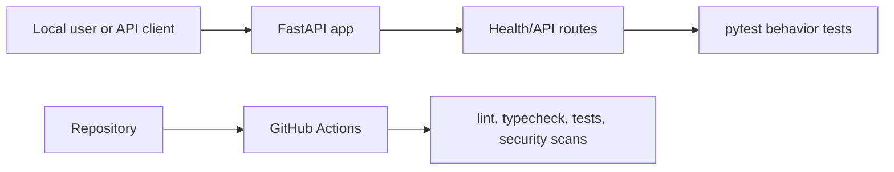

# Endpoint Identity Control Plane

<!--
Before publishing:
1. Replace the title, one-liner, repository URLs, and examples.
2. Replace placeholder badges with real GitHub Actions badge links after the repo exists.
3. Delete this comment block.
-->

A small FastAPI service template for building secure, testable Python APIs with repeatable CI and security checks.

**Status:** Portfolio/demo starter. Use fake data only; this scaffold is designed for local review and private hardening before public release.

<!-- Optional once the repo exists:
[](https://github.com/<owner>/<repo>/actions/workflows/ci.yml)


-->

## Overview

Endpoint Identity Control Plane is a starter API for practicing production-shaped software development in a safe lab environment. It gives a new project a working FastAPI app, test suite, GitHub Actions workflow, dependency-update configuration, security policy, and reusable Hermes/Codex development artifacts.

Use it as the baseline for small portfolio or learning projects where the goal is not just to write code, but to show the full lifecycle: planning, implementation, review, testing, CI, security checks, documentation, and public-release readiness.

The default app is intentionally minimal. Project-specific behavior, architecture decisions, screenshots, and examples should be added before publishing the repository publicly.

## What it demonstrates

- FastAPI project structure with a simple health endpoint.
- Python quality gates with Ruff, mypy, pytest, Bandit, Gitleaks, and pip-audit.
- GitHub Actions CI with least-privilege permissions and workflow linting.
- Public-release discipline: README quality, security posture, threat model, branch protection, and publication review.
- AI-assisted development governance: Codex implements narrow lanes; Hermes reviews, verifies, and preserves reusable lessons; Richie remains final reviewer.

## Quick start

```bash
python3 -m venv /tmp/endpoint-identity-control-plane-venv
. /tmp/endpoint-identity-control-plane-venv/bin/activate
python -m pip install -U pip
python -m pip install -e '.[dev]'
make all
```

Run the app locally:

```bash
uvicorn endpoint_identity_control_plane.app:app --reload
```

Open:

- API docs: <http://127.0.0.1:8000/docs>
- ReDoc: <http://127.0.0.1:8000/redoc>
- Health check: <http://127.0.0.1:8000/health>

## Local container lane

This repository includes a local-only container rehearsal for the FastAPI app. It is intended for private sandbox validation, not production deployment or registry publication.

Build and inspect the image:

```bash
docker compose build api
docker compose config
```

Run the API on loopback only:

```bash
docker compose up -d api
curl --fail --silent http://127.0.0.1:8000/health
docker compose exec -T api id
```

Run optional local container checks when the tools are installed:

```bash
hadolint Dockerfile
dockerfilelint Dockerfile
trivy fs .
trivy image endpoint-identity-control-plane-api:local
syft .
grype dir:.
```

Clean up local containers and volumes:

```bash
docker compose down -v
```

Safety limitations:

- Examples are fake, local, and private.
- Compose binds the API to `127.0.0.1:8000` only.
- The image runtime uses a non-root app user.
- The container lane does not add cloud deployment, registry push, Kubernetes, production secrets, or real data handling.
- Passing local container checks does not mean the project is public-release or production ready.

## Example request

```bash
curl -s http://127.0.0.1:8000/health | python -m json.tool
```

Example output:

```json
{
  "status": "ok"
}
```

## Architecture

The starter keeps the first version deliberately small: one FastAPI application module, one health-check test, and a reusable validation contract in the Makefile. As the project grows, add domain modules under `src/`, behavior tests under `tests/`, and architecture decisions under `docs/adr/`.



## Project docs

- [Architecture](docs/architecture.md)
- [API notes](docs/api.md)
- [Development workflow](docs/development.md)
- [Testing and quality gates](docs/testing.md)
- [Security posture](docs/security-posture.md)
- [Threat model](docs/threat-model.md)
- [Publication runbook](docs/publication-runbook.md)
- [Public repository file policy](docs/public-repo-file-policy.md)
- [Design decisions](docs/adr/)

## Configuration

Copy `.env.example` only as a placeholder reference. Do not commit real `.env` files.

- `APP_ENV`: local environment label. Default: `development`.
- `LOG_LEVEL`: application log level. Default: `INFO`.

Update this section when project-specific settings are added.

## Testing and checks

Run the full local gate:

```bash
make all
```

Run the stricter pre-publication gate:

```bash
make public-release-check
hermes-publication-gate --repo .
hermes-sec-scan --repo .
```

The public-release gate should pass before making the repo public, changing visibility, creating a release, publishing a package, or pushing a container image.

## Public release checklist

Before publishing:

- Replace all template names and examples.
- Add real project behavior and meaningful tests.
- Replace placeholder badge URLs with real repository badge links.
- Confirm `.env.example` contains placeholders only.
- Review `AGENTS.md` and `.hermes/` content for public-safe wording.
- Remove raw AI scratch work, private retrospectives, generated reports, caches, and local environment files.
- Run the publication runbook and record validation evidence.

For repeatable public-readiness work beyond this Python/FastAPI template, use the stack-neutral baseline pack at:

```text
/root/.hermes/project-templates/public-ready-baseline/
```

That pack defines the reusable maturity lanes, public-ready checklist, lane-plan template, validation-log template, and cross-stack validation matrix for future Python, TypeScript, Go, Rust, shell, Docker, CI/CD, and IaC projects.

## Scope and limitations

This scaffold is not production software by itself. It does not include authentication, persistence, deployment infrastructure, monitoring, backups, or production incident response. Add those deliberately in separate reviewed lanes when the project needs them.

Use fake data only until a project-specific data handling and publication review has been completed.
