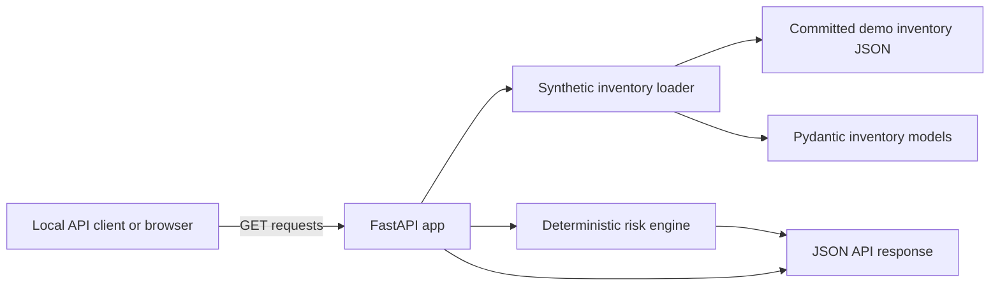

# Architecture

## System overview

Endpoint Identity Control Plane is a local FastAPI service that evaluates synthetic endpoint and identity inventory. It is built to demonstrate endpoint administration, identity hygiene, and endpoint security reasoning without connecting to real enterprise systems.

Current service boundary:

- **Input:** HTTP `GET` requests from a local API client or browser.
- **Data source:** committed synthetic JSON fixture at `src/endpoint_identity_control_plane/data/demo/inventory.json`.
- **Validation:** Pydantic models in `src/endpoint_identity_control_plane/models.py` validate inventory shape and cross-record references.
- **Risk logic:** deterministic Python rules in `src/endpoint_identity_control_plane/risk.py` create findings and summarized risk reports.
- **Output:** JSON responses returned by FastAPI routes in `src/endpoint_identity_control_plane/app.py`.

The current MVP has no database, external network integration, authentication layer, queue, worker, VM dependency, or live Microsoft tenant connection.

## Component diagram

Mermaid sources also live in `docs/diagrams/` for later rendering during the public-readiness lane.

## Request flow

1. A local client calls an endpoint such as `GET /risk-report`.
2. The FastAPI route loads the committed synthetic inventory fixture.
3. The loader rejects obvious secret-like fixture markers and validates the data with Pydantic models.
4. The risk engine evaluates deterministic rules against users and devices.
5. The route returns typed JSON containing findings, severity/category counts, and top risky assets.

For static inventory endpoints such as `/users`, `/devices`, and `/groups`, the route returns validated synthetic records directly.

## Data model

The MVP models three inventory areas:

- **Users:** username, display name, department, enabled state, last login, MFA state, privileged groups, and assigned devices.
- **Devices:** hostname, assigned user, OS, last check-in, patch status, encryption state, local admin count, compliance state, and imaging state.
- **Groups:** name, privilege level, and member users.

The `Inventory` model validates relationships so demo fixtures cannot quietly reference missing users, devices, or groups.

## Trust boundaries

### External client to FastAPI API

HTTP clients are outside the application boundary. The current MVP exposes read-only `GET` endpoints and does not accept request bodies, credentials, or user-controlled inventory changes.

### Source repository to synthetic data fixture

The committed JSON fixture is treated as project data, but it is still validated before use. The fixture must remain fake and public-safe.

### Application to dependency/toolchain boundary

Validation, linting, type checking, and security scanning rely on the Python environment and installed tools. Dependency and scanner output must be reviewed before public release.

## Implemented controls

- Read-only API endpoints for the current MVP.
- Pydantic models with strict/frozen behavior for inventory and risk objects.
- Cross-reference validation between users, devices, and groups.
- Synthetic-data classification in version and risk-report responses.
- Deterministic timestamp for demo risk reports to keep tests and examples stable.
- Unit and API tests through FastAPI `TestClient`.
- Local gates for Ruff, strict Ruff source checks, mypy, pytest, Gitleaks, Bandit, and pip-audit advisory output.

## Deferred controls

These are intentionally deferred and should not be implied as implemented:

- Authentication and authorization.
- Persistence/database storage.
- Write APIs or inventory import APIs.
- Real Microsoft Graph, Entra ID, Intune, SCCM/MECM, Defender, AD, or SIEM integrations.
- Production logging, metrics, tracing, alerting, or incident response workflow.
- Rate limiting and abuse protection.
- Production deployment hardening.
- VM-based AD/SCCM homelab integration.

## Production caveats

The current architecture is suitable for local portfolio review and deterministic testing. A production system would need a different architecture: authenticated users, tenant separation, secure data ingestion, persistence, audit logging, rate limiting, robust error handling, observability, deployment hardening, secrets management, and a formal data governance model.
