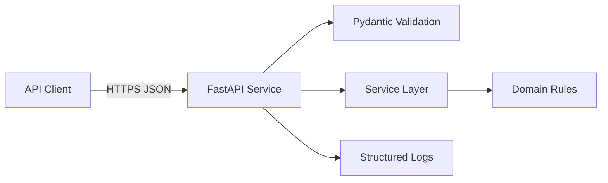

# Architecture

## System overview

Replace this section with a concise explanation of the service boundary, users, trusted/untrusted inputs, and major components.

## Request flow

See `docs/diagrams/request-flow.mmd` for the Mermaid source.

## Trust boundaries

- External clients are untrusted.
- Request bodies are untrusted until validated.
- Secrets must come from the runtime environment, not source code.
- Logs must not include secrets or sensitive request bodies.

## Production caveats

Document which controls are implemented locally and which would need production-grade replacements.
